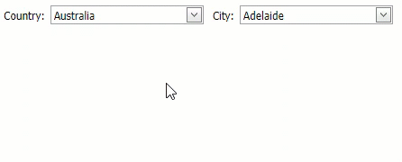

<!-- default badges list -->

[](https://supportcenter.devexpress.com/ticket/details/E2355)
[](https://docs.devexpress.com/GeneralInformation/403183)
<!-- default badges end -->
<!-- default file list -->
*Files to look at*:

* [Default.aspx](./CS/WebSite/Default.aspx) (VB: [Default.aspx](./VB/WebSite/Default.aspx))
* [Default.aspx.cs](./CS/WebSite/Default.aspx.cs) (VB: [Default.aspx.vb](./VB/WebSite/Default.aspx.vb))
<!-- default file list end -->
# A general technique of using cascading ASPxComboBoxes
<!-- run online -->
**[[Run Online]](https://codecentral.devexpress.com/e2355/)**
<!-- run online end -->

This demo shows how to implement cascading [ASPxComboBoxes](https://docs.devexpress.com/AspNet/DevExpress.Web.ASPxComboBox).




The general technique for implementing cascading [ASPxComboBoxes](https://docs.devexpress.com/AspNet/DevExpress.Web.ASPxComboBox) is as follows:

1. In the [SelectedIndexChanged](https://docs.devexpress.com/AspNet/js-ASPxClientComboBox.SelectedIndexChanged) event handler of the first [ASPxComboBox](https://docs.devexpress.com/AspNet/DevExpress.Web.ASPxComboBox), perform callback on the second [ASPxComboBox](https://docs.devexpress.com/AspNet/DevExpress.Web.ASPxComboBox) using the [PerformCallback](https://docs.devexpress.com/AspNet/js-ASPxClientCallback.PerformCallback(parameter)) method. Pass the first [ASPxComboBox](https://docs.devexpress.com/AspNet/DevExpress.Web.ASPxComboBox)'s value to the server in a [callback parameter](https://docs.devexpress.com/AspNet/js-ASPxClientCallback.PerformCallback(parameter)#parameters).
```xml
<script type="text/javascript" language="javascript">
    function OnCountryChanged() {
        cityCombo.PerformCallback(countryCombo.GetSelectedItem().value.toString());
    }
    
    ...

<dx:ASPxComboBox runat="server" ID="CountryCombo" ClientInstanceName="countryCombo" ...>
    <ClientSideEvents SelectedIndexChanged="OnCountryChanged"/>
    ...
```
2. In the server-side [Callback](https://docs.devexpress.com/AspNet/DevExpress.Web.ASPxCallback.Callback) event handler of the second [ASPxComboBox](https://docs.devexpress.com/AspNet/DevExpress.Web.ASPxComboBox), update the data source using the value passed in the [callback parameter](https://docs.devexpress.com/AspNet/js-ASPxClientCallback.PerformCallback(parameter)#parameters) as a filter.
``` c#
    protected void CityCombo_Callback(object source, DevExpress.Web.CallbackEventArgsBase e) {
        FillCityCombo(e.Parameter);
    }
    protected void FillCityCombo(string country) {
        if (string.IsNullOrEmpty(country)) return;
        
        //Update the data source bound to the second combobox.
        CityDataSource.SelectParameters["CountryName"].DefaultValue = country;
        CityCombo.DataBind();

        //Select the first city in a list
        CityCombo.SelectedIndex = 0;
    }
```

